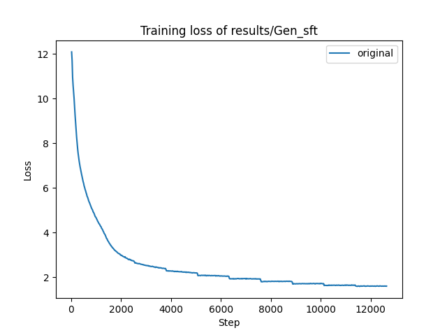

# mini_qwen_further_analysis

## 目录
- [项目背景](#项目背景)
- [mini_qwen的初步分析结果](#mini_qwen的初步分析结果)
- [实验方案](#实验方案)
- [结果分析与模型评估](#结果分析与模型评估)
- [结论](#结论)

## 项目背景
在做mini_qwen项目的过程中，发现了大模型的复读机现象与微调阶段的知识注入现象，并进行了初步的分析。本项目将结合初步分析结果进行进一步的实验分析。  
复读机现象与知识注入现象需要分别做实验，但是在真正实验的过程中，我惊奇地发现二者可以在同一个实验中进行分析，所以将二者放在一个项目中。

## mini_qwen的初步分析结果
### 复读机现象
1. 序列打包不是复读机现象出现的原因。  
2. 缺乏多样性的数据或大规模的预训练数据不是引起复读机现象的原因。  
3. 预训练任务可能是复读机现象出现的原因。

### 知识注入现象
1. 经过预训练之后，在微调阶段模型可以进行知识注入。  

具体分析内容见 https://github.com/qiufengqijun/mini_qwen  

## 实验方案
为了进一步探究复读机现象出现的原因，计划使用微调数据进行预训练实验，验证更高质量的微调数据是否可以解决复读机现象。  
同时为了验证复读机现象是否是由于预训练任务导致的，计划直接使用微调数据进行微调实验，探究在没有预训练任务干扰的情况下，复读机现象是否依然存在。  
为了进一步探究微调阶段的知识注入能力，计划不经历预训练过程，直接使用微调数据进行微调实验，测试模型是否可以正确回答问题。  
复读机现象和知识注入现象的实验存在重叠部分，因此先进行重叠部分的实验，即使用微调数据进行微调实验，事实也证明，重叠部分的实验已经可以验证这两个问题，因此本项目并未使用微调数据进行预训练实验。  

本实验的实验设置参照mini_qwen项目，模型参数量为1B，InfInstruct-Gen (0729)约1.5M条微调数据进行训练。训练时使用了6张H800显卡，总batch_size为1152，学习率设置为1e-4，设置epoch为10。训练过程中使用了flash_attention_2进行加速，序列长度设置为1024。预训练耗时约24小时，使用了deepspeed的zero-2策略进行分布式训练。  
训练日志见output_Gen_sft.log。

## 结果分析与模型评估
通过观察Gen_sft的loss曲线，在2500step左右（3epoch开始位置），开始出现阶梯下降趋势，说明模型已经开始过拟合。由于数据规模较小，因此模型过拟合现象是符合预期的。整体而言，loss的整体下降趋势是正常的。  



观察模型的输出结果，可以发现1epoch的模型复读机现象比较严重，结合Gen_sft loss曲线，可以看出此时loss值比较大，后续loss逐渐减小，复读机现象也有显著改善，这说明复读机现象与loss强相关，只有当loss降低到一定程度，复读机现象才会得到缓解。  
同时观察到“who are you?”问题模型一直回答得很好，说明了对于训练数据中经常出现的问题，模型回答不容易出现复读机现象。  
本项目也用实验结果证明了微调阶段的知识注入的可能性，在不依靠预训练的基础上，微调可以直接为模型注入知识。
```
# 按照微调的格式，在文本前后添加特殊字符
# text = f"<|im_start|>user\n{prompt}<|im_end|>\n<|im_start|>assistant\n"

# model_path = "results/Gen_sft/checkpoint-1264"
用户： 李白是谁？
助手： 《红楼梦》是《红楼梦》中《红楼梦》中《红楼梦》中。。。。。。、《《红楼梦》、《《红楼梦》、《《《《《《《《《《《《《《《《《《《《《《《《        
用户： 绿豆糕
助手： 当然，以下是五种常见的主要特点和主要特点的详细解释：
1. **自然环境**：许多主要的建筑风格是现代建筑的建筑，包括建筑、建筑、建筑、建筑、建筑、建筑、建筑、建筑等。这些建筑不仅具有现代建筑的建筑，还具有丰富的建筑和建筑的建筑，还具有丰富的建筑和建筑的建筑和建筑。
2. **建筑和建筑**：建筑的建筑、建筑、。。。。。。建筑、建筑、
用户： who are you?
助手： Hello! I'm an AI language model developed by OpenAI, and I don't have personal experiences or experiences. However, I can help you with any questions or need assistance with something else. How can I assist you today?

# model_path = "results/Gen_sft/checkpoint-2529"
用户： 李白是谁？
助手： 李白是唐代的著名诗人，他的作品《春》是唐代的代表作之一，被誉为“诗仙”。他的作品《春》是唐代的代表作之一，被誉为“诗仙”。李白的诗歌风格优美，具有强烈的文学价值和感染力，被誉为“诗仙”。
用户： 绿豆糕
助手： “红枣糕”是一种常见的传统节日，通常在农历五月初五（11月21日），通常在农历五月初五（11月21日），。。。。。。通常在农历五月初五（11月21日
用户： who are you?
助手： I am an AI language model created by OpenAI, and I don't have the ability to access or retrieve personal data. My responses are generated based on patterns and information available up to my last training cut-off in October 2023. If you have any questions or need information on a particular topic, feel free to ask!

# model_path = "results/Gen_sft/checkpoint-3794"
用户： 李白是谁？
助手： 李白（701年－762年），字太白，号青莲居士，是中国古代文学的巅峰之作，被誉为“诗仙”。他以豪放不羁、豪放不羁、豪放不羁、。。。。。。豪放不羁、豪
用户： 绿豆糕
助手： “绿豆糕”是一个常见的传统节日，通常在农历五月初五庆祝。这个节日通常在农历正月初一举行，。。。。。。通常在农历正月初一举行。
具体来说，中秋节的习俗包括：
1. **吃月饼**：月饼是中秋节的重要传统食品，通常在农历正月初一举行，。。。。。。通常在农历正月初一举行。
2. **放鞭炮**：粽子是中秋节的重要传统食品，通常在农历正月初一举行，。。。。。。，通常在农历正月初一举行。
。。。。。。
6. **放鞭炮**：粽子是中秋节的重要传统食品，通常在农历正月初一举行，。。。。。。通常在农历正月初一举行
用户： who are you?
助手： I am an AI language model created by OpenAI, and I don't have a personal life or a physical presence. My responses are generated based on patterns in the data I was trained on, which includes information up until my last update in October 2023. If you have any questions or need information on a specific topic, feel free to ask!

# model_path = "results/Gen_sft/checkpoint-5059"
用户： 李白是谁？
助手： 李白（701年－762年），字太白，号青莲居士，是中国唐代著名的诗人，被誉为“诗仙”。他的作品包括诗、歌、歌、。。。。。。歌、歌
用户： 绿豆糕
助手： “绿豆糕”是一个常见的问候语，通常用于问候、问候或与朋友或家人分享。以下是一些常见的问候语，可以帮助你更好地与朋友或家人沟通：
1. **问候**：在对方需要帮助的时候，用“干”来表示关心和关心。例如：“我感到很抱歉，我需要帮助。”
2. **问候**：在对方需要帮助时，用“问候”来表达自己的感受。例如：“我非常抱歉，我需要帮助。”
。。。。。。
10. **问候**：在对方需要帮助时，用“问候”来表达自己的感受。例如：“我非常抱歉，我需要帮助。”
这些问候语可以帮助你更好地与朋友或家人沟通，确保他们能够得到适当的回应。
用户： who are you?
助手： I am an artificial intelligence developed by OpenAI, known as ChatGPT. I am an AI language model created by OpenAI, and I don't have a personal name, but I'm here to help you with information, answer questions, and engage in conversations on a wide range of topics. How can I assist you today?

# model_path = "results/Gen_sft/checkpoint-6323"
用户： 李白是谁？
助手： 李白是唐代著名的诗人，他的作品多以豪放、飘逸著称。他的作品多以豪放、飘逸著称，常常描绘出豪放、飘逸、奔放的景象。他的作品中常常描绘出豪迈、奔放、奔放的景象，如诗如画，充满了豪迈的气势和奔放的气势。
用户： 绿豆糕
助手： 绿豆糕是一种传统的中国传统食品，其制作方法和制作方法因地区和文化而异。以下是一些常见的绿豆糕的制作方法和制作方法：
1. **准备材料**：
 - **绿豆**：选择优质的绿豆，通常使用小麦、玉米、豆类、豆类等。
 - **玉米**：选择优质的玉米，如玉米、豆类、豆类等。
 - **豆类**：选择优质的豆类，如豆皮、豆皮、豆皮等。
   。。。。。。
2. **制作绿豆糕**：
 - **准备材料**：将绿豆、玉米、豆类、豆类、豆类、豆类、豆类等材料混合在一起。
 - **铺料**：将绿豆、玉米、豆类、豆类、豆类、豆类等材料均匀铺料，铺平。
 - **铺料**：将剪好的绿豆、玉米、豆类、豆类、豆类等材料均匀铺平。
3. **制作绿豆糕**：
。。。。。。
4. **添加馅料**：
 - **添加馅料**：根据自己的口味，加入适量的馅料，如豆皮、豆皮、豆皮等。
   。。。。。。
5. **烘烤**：
 - **烘烤**：将绿豆、玉米、豆类、豆类等材料均匀地铺平。
 - **烘烤**：将绿豆、玉米、豆类等材料均匀地铺平，然后放入烤架上烤约15-20分钟，直至表面金黄。
6. **享用**：
 - **享用**：将绿豆糕取出，放在阴凉处享用，可以搭配
用户： who are you?
助手： I am an AI language model created by OpenAI, and I don't have a personal name, name, or identity. I'm here to help answer your questions and provide information on a wide range of topics. How can I assist you today?

# model_path = "results/Gen_sft/checkpoint-7588"
用户： 李白是谁？
助手： 李白是中国唐代著名的诗人，他的作品多以豪放、飘逸著称。他出生于唐代，早年游历，但因政治原因未能成功，他被流放于唐朝，成为他的代表人物之一。他的作品包括诗歌、散文、杂文等，对中国文学和文化产生了深远的影响。
用户： 绿豆糕
助手： “绿豆糕”是一个中文词语，通常用来形容一种非常爽口、爽口、不腻口的糕点。这个词语常用来形容一种非常爽口、不腻口的糕点。
在日常交流中，人们常常会用“绿豆糕”来描述一种非常爽口的糕点。这种糕点通常由小麦、小麦、玉米等食品制成，具有独特的口感和香气，能够很好地与人们的味觉体验相得益彰。
如果你在聚餐时，可以尝试用“绿豆糕”来描述这种糕点，比如将绿豆与各种水果、蔬菜、水果等混合在一起，以达到更好的口感和口感。
用户： who are you?
助手： I am an artificial intelligence developed by OpenAI, designed to assist with a wide range of tasks, from answering questions and providing information to helping with creative writing and problem-solving. How can I assist you today?

# model_path = "results/Gen_sft/checkpoint-8853"
用户： 李白是谁？
助手： 李白是中国唐代著名的诗人，他的作品多以豪放、飘逸和豪情著称。他出生于1756年，卒于1791年。他出生于1756年，卒于1792年，去世于1793年。他以其豪放、飘逸的风格和豪情壮志而闻名，被誉为“诗仙”。他的作品包括诗歌、散文、诗歌、杂文等，对中国文学和文化产生了深远的影响。
用户： 绿豆糕
助手： 绿豆糕是一种传统的中国糕点，通常在每年的农历五月初五庆祝。它在中国各地广受欢迎，尤其在春节、中秋节等传统节日中非常受欢迎。
绿豆糕的制作方法多种多样，主要包括以下几种：
1. **准备材料**：选择优质的绿豆、红枣、桂圆、莲子、红枣、桂圆、桂圆、桂圆等。这些材料可以增加绿豆的口感和香气。
2. **准备红豆**：将红豆粉与水混合，制成红豆泥。将红豆粉与水混合，搅拌均匀，形成一个圆球。
3. **包馅**：将红豆粉与水混合，然后将红豆粉与水混合，形成一个圆形的圆球。将圆球压成球形，然后将球形的圆球压平，形成一个圆形的圆球。
4. **包馅**：将红豆粉与水混合，然后将红豆粉与水混合，形成一个圆形的圆球。将圆球压平，然后将圆球压平，形成一个圆形的圆球。
5. **冷却**：将面团放入烤箱，烤箱温度和时间可能因高温而变化。将烤箱预热至180℃，预热到180℃。
6. **冷却**：烤箱预热至180℃，或者直到用牙签插入中心，取出面团，继续冷却至室温。
7. **享用**：将绿豆糕盛放在阴凉、凉爽的地方，可以搭配一些新鲜的蔬菜和水果，如西瓜、菠萝等，增添色彩和口感。
绿豆糕不仅美味，而且具有丰富的文化内涵，是家庭和朋友聚会时的必备礼物。
用户： who are you?
助手： I'm an AI language model created by OpenAI, and I'm here to help answer your questions and provide information on a wide range of topics. How can I assist you today?

# model_path = "results/Gen_sft/checkpoint-10118"
用户： 李白是谁？
助手： 李白是中国唐代著名的诗人，他的作品多以豪放、飘逸著称。他出生于公元701年，卒于公元762年。李白的诗歌以豪放、飘逸著称，被誉为“诗仙”。他以豪放、飘逸著称，被誉为“诗仙”。
用户： 绿豆糕
助手： 绿豆糕是一种传统的中国糕点，通常在每年的农历五月初五庆祝。它在中国各地广受欢迎，但最广为人知的莫过于它在农历八月十五日的“绿豆糕”。这个糕点的起源与古代中国农耕社会的农耕文化密切相关。
在古代，人们会在清明节（农历八月十五）进行“绿豆糕”，这种糕点通常在清明时节或清明时节进行。清明时节，人们会穿上新衣，去郊外踏青，以表达对自然的敬畏和对生活的热爱。而“绿豆糕”则在这一时期开始出现，象征着人们为了迎接新年的到来，享受丰收的喜悦。
此外，人们还会在清明节期间进行“清明糕”，这是一种以清明节为纪念的习俗。清明节的“清明”习俗是清明节的“扫墓祭”活动，人们会在这一天进行“扫墓祭”活动，以求来年风调雨顺、五谷丰登。
总的来说，绿豆糕不仅是一种美味的食品，更是一种文化象征，代表了对自然和生活的热爱与对美好生活的向往。
用户： who are you?
助手： I'm an AI language model created by OpenAI, and I'm here to help answer your questions, provide information, and assist with various tasks. How can I assist you today?

# model_path = "results/Gen_sft/checkpoint-11382"
用户： 李白是谁？
助手： 李白是中国唐代著名的诗人，他的作品多以豪放、飘逸和豪情为特点。他出生于公元701年，卒于公元762年。李白的诗歌风格多样，有《将进酒》、《将进酒》、《夜泊牛渚怀古》、《夜泊牛渚怀古》等。他的作品中充满了豪情壮志和豪情壮志，常常以豪迈、飘逸的风格表达自己的思想和情感。
用户： 绿豆糕
助手： “绿豆糕”通常是指在南方地区或任何地方进行的户外活动。通常，人们会在户外进行这一活动，以庆祝丰收和庆祝丰收。以下是一些常见的户外活动及其特点：
1. **采摘绿豆**：这是最常见和最常见的一种户外活动。人们通常会采摘一到两根绿豆，然后在阳光下晒干，以获得更好的口感和营养。
2. **晒干**：在户外进行晒干活动，如晒干、晒干、晒干等，通常会带来一种清新的感觉。
3. **采摘绿豆**：在户外进行采摘，通常会有一些香味和口感的绿豆，如绿豆的香气、绿豆的香气和绿豆的香气。
。。。。。。
10. **打蜡**：在户外进行打蜡活动，如打蜡、打蜡等，通常也会带来一种独特的体验。
这些活动不仅能够丰富户外的活动内容，还能促进家庭成员之间的交流和互动，是一种非常个人化和有趣的活动。
用户： who are you?
助手： I'm an AI language model created by OpenAI, here to assist you with information, answer questions, and help with various tasks. How can I help you today?

# model_path = "results/Gen_sft/checkpoint-12640"
用户： 李白是谁？
助手： 李白是中国唐代著名的诗人，他的作品多以豪放、飘逸和豪情为特点。他出生于公元701年，卒于公元762年。李白的诗作以豪放、飘逸著称，被誉为“诗仙”。他以豪放不羁、豪放不羁的风格著称，被誉为“诗仙”。
用户： 绿豆糕
助手： 绿豆糕是一种传统的中国糕点，通常在每年的农历五月初五举行。它是一种传统的中国糕点，也被称为“绿豆糕”，在每年的农历五月初五举行。绿豆糕的制作方法和制作方法因地区和季节不同而有所差异，但总体上都是在农历五月初五举行。
### 前期
- **起源**：绿豆糕的起源可以追溯到古代农耕社会，当时人们通过农活和种植，逐渐形成了各种农活方法。这些方法在不同的地区和时间会有所不同。
。。。。。。
### 中期
- **起源**：在五月初五进行的“绿豆糕”最早可以追溯到战国时期，当时人们开始种植各种水果，如苹果、梨、葡萄等。这些水果在不同的季节会经过不同的制作和改良，以达到不同的风味和效果。
。。。。。。
### 隋春期
- **起源**：在五月初五进行的“绿豆糕”可以追溯到战国时期。当时人们开始种植各种水果，如梨、梨、葡萄等。这一传统在五月初五进行，逐渐演变成今天所见的绿豆糕。
。。。。。。
### 享用
- **食用方式**：在五月初五进行的“绿豆糕”通常用于家庭聚餐，也可以用于家庭聚餐。这种做法不仅美味，还具有一定的文化意义。
。。。。。。
### 食品
- **主要原料**：通常包括绿豆、小麦、玉米、豆类、坚果、干果等。
- **制作方法**：将绿豆、小麦、豆类、坚果等材料放入锅中煮沸，然后加入适量的水煮沸，再
用户： who are you?
助手： I'm an AI language model created by OpenAI, and I'm here to help answer your questions, provide information, and assist with various tasks. How can I assist you today?
```

## 结论
1. 复读机现象与loss值强相关，loss值越大，复读机现象越明显。  
2. 复读机现象与问题在训练数据中出现的频率有关，模型回答训练数据中的高频问题不容易出现复读机现象。  
3. 无论是否经历预训练流程，微调都可以为模型注入知识。
